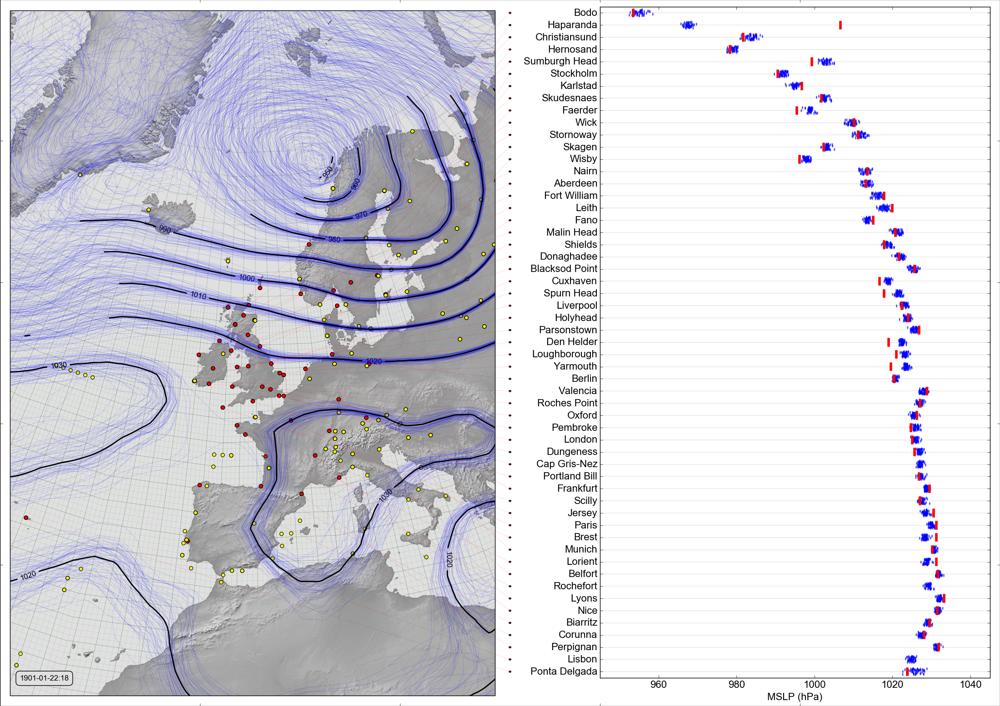

Reanalysis and uncertainty
==========================

One good thing about the 20CR and CERA-20C reanalyses is that each of them is an ensemble product (20CR2c is a 56-member ensemble and CERA-20C a 10-member one), and the divergence between the ensemble members is a useful metric of the reconstruction uncertainty. This is clearly seen in a `spaghetti-plot <analyses/spaghetti_contour/spaghetti_contour.html>`_ of mean-sea-level pressure (MSLP):

|

.. figure:: ../analyses/spaghetti_contour/Spaghetti_prmsl_1903102218.png
   :width: 650px
   :align: center
   :figwidth: 700px

   MSLP Contours for 20CR2c for October 22nd, 1903 (at 6pm).

   Blue lines are contours from each of ensemble member, black lines the contours of the ensemble mean (only shown where the ensemble spread is less than 3hPa). Yellow dots are observations asssimilated. (`More <analyses/spaghetti_contour/spaghetti_contour.html>`_)

|

It is clear that the ensemble behaves as expected: where there are many nearby observations the ensemble members are close together and the reconstruction uncertainty is low. Where there are no nearby observations, the ensemble members are different and the reconstruction uncertainty is large.

To see how well the reanalysis ensemble spread represents its actual uncertainty, it can be compared to `additional, unassimilated, observations <data/data_from_weatherrescue.html>`_:

|

   MSLP ensemble for 20CR2c, and observations, for January 22nd, 1901 (at 6pm).

   MSLP `as observed at each DWR station <data/data_from_weatherrescue.html>`_ (red line), and as reconstructed by the 20CR2c ensemble at the station location (blue dots), combined with a spaghetti-contour plot as above. (`More <analyses/scatter+contour/scatter_and_contour.html>`_)

|

The 20CR2c MSLP ensemble is slightly overconfident (in this case), with the observed values often lying outside the ensemble spread (`CERA-20C is better in this respect <analyses/scatter+contour/scatter_and_contour_CERA20C.html>`_), but the ensemble spread does scale in the right way, with more ensemble spread where the observation is farther from the ensemble mean (shown more clearly in `a video comparison over a month <analyses/scatter+contour/scatter_and_contour_20CR2c_video.html>`_). Note that the observations are not perfect, each will always include some small error, and sometimes they are very wrong (for example, Haparanda in the figure above).
